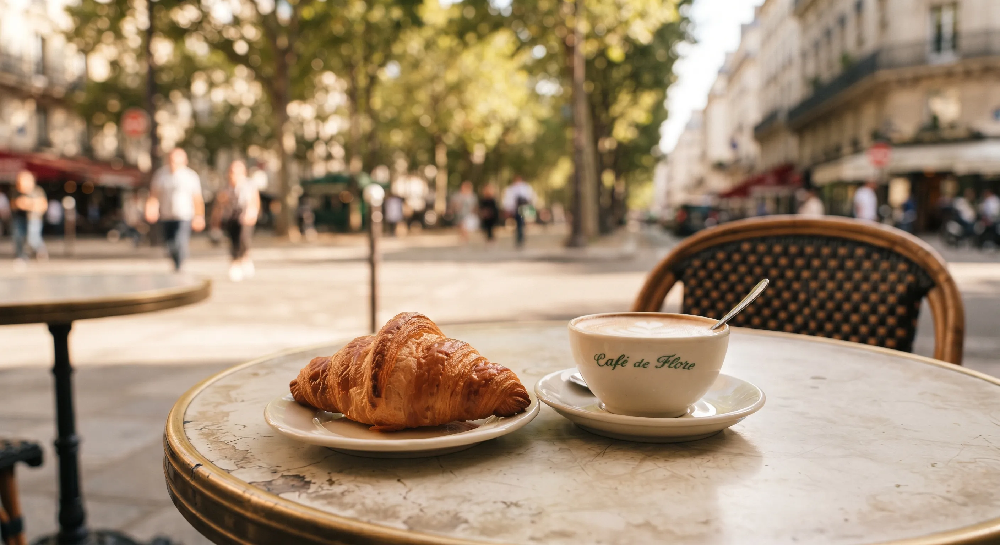
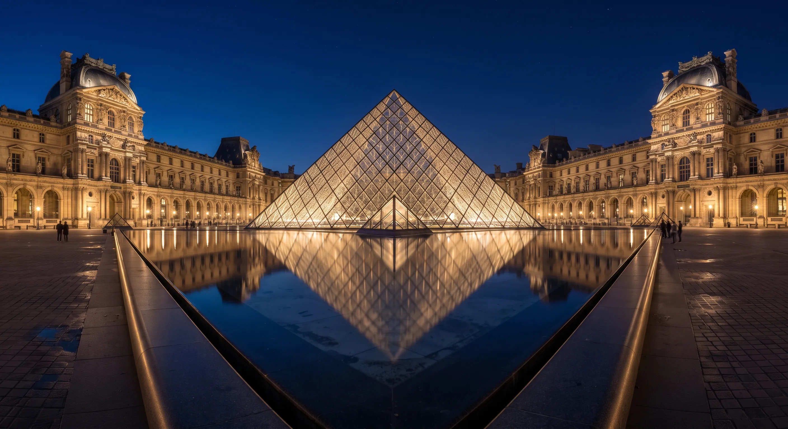
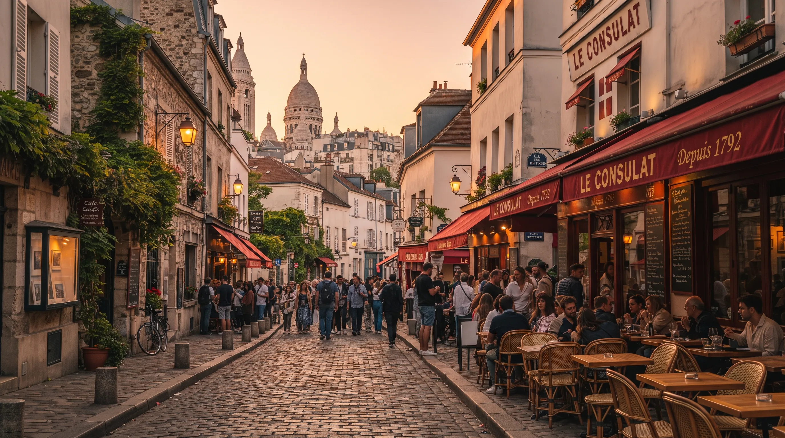
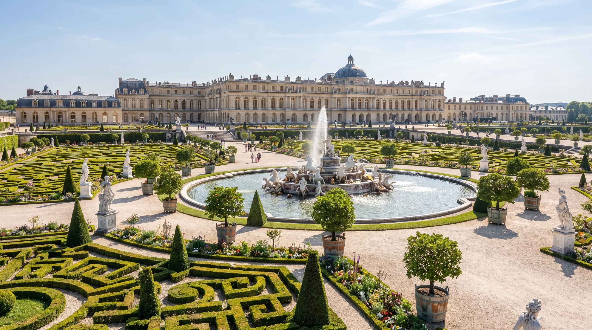

## Introdução

Visitar Paris pela primeira vez exige estratégia para não perder tempo em filas ou deslocamentos confusos. Este roteiro de **4 dias** reúne os pontos turísticos mais icônicos da capital francesa de forma lógica e eficiente, garantindo que você aproveite o melhor da Cidade Luz sem exaustão.

## Dia 1: O Coração Histórico e a Torre Eiffel

O primeiro dia foca nos cartões-postais mais famosos de Paris, começando pela margem do Rio Sena.

* **Manhã:** Comece cedo na **Torre Eiffel**. Compre o ingresso com antecedência para subir até o topo. Caminhe pelos **Champ de Mars** logo após a subida.
* **Tarde:** Faça um cruzeiro de 1 hora pelo **Rio Sena** para ter uma vista panorâmica inesquecível dos monumentos. Siga para o **Arco do Triunfo** e caminhe pela famosa **Avenue des Champs-Élysées**.
* **Noite:** Jante em um bistrô tradicional na região de **Île de la Cité** e aprecie a **Catedral de Notre-Dame** iluminada.

## Dia 2: Arte, Luxo e História

Dedique o segundo dia à cultura mundial e à grandiosidade arquitetônica parisiense.

* **Manhã:** Visite o **Museu do Louvre**. Foque nas obras principais (como a *Mona Lisa* e a *Vitória de Samotrácia*) para não se esgotar.
* **Tarde:** Caminhe pelos **Jardins das Tulherias** até a **Place de la Concorde**. Siga em direção à **Galeries Lafayette** para ver a icônica cúpula e fazer compras ou apreciar a vista do terraço.
* **Noite:** Explore as ruas vibrantes do bairro **Opera** para um jantar clássico.

## Dia 3: Boemia em Montmartre

O terceiro dia é dedicado ao charme artístico e histórico de um dos bairros mais pitorescos da cidade.

* **Manhã:** Sude a colina de **Montmartre** até a imponente **Basílica de Sacré-Cœur**. Visite a **Place du Tertre** para ver pintores de rua trabalhando.
* **Tarde:** Desça o morro explorando as ruas estreitas, passando pelo **Moulin Rouge** e seguindo para o charmoso **Bairro Latino** (Quartier Latin).
* **Noite:** Curta o clima universitário e jante em um dos bistrôs acolhedores do Bairro Latino.

## Dia 4: Palácios e Jardins Reais

Encerre sua viagem com chave de ouro explorando a opulência da realeza francesa.

* **Manhã:** Pegue o trem RER C para visitar o deslumbrante **Palácio de Versalhes**. Conheça os Apartamentos Reais e a famosa **Galeria dos Espelhos**.
* **Tarde:** Caminhe pelos extensos e geométricos **Jardins de Versalhes**. Retorne a Paris no fim da tarde.
* **Noite:** Despeça-se da cidade com um jantar romântico às margens do Sena.

## Resumo Prático

| Dia | Foco Principal | Destaque |
| :--- | :--- | :--- |
| **Dia 1** | Ícones e Sena | Torre Eiffel e Champs-Élysées |
| **Dia 2** | Arte e Compras | Museu do Louvre e Galeries Lafayette |
| **Dia 3** | Boemia | Montmartre e Bairro Latino |
| **Dia 4** | Realeza | Palácio de Versalhes |
